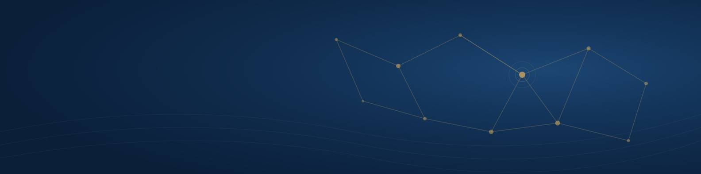

<h1 align="center">Hi, I'm Víctor 👋</h1>

<b>Computer Engineering student @ UPC Barcelona</b> · AI Automation · Web Development

  
  

---

### 🚀 About me
I enjoy turning manual, repetitive work into **automated systems** and building **fast, clean websites** for real businesses.

- ⚙️ **AI automation:** n8n workflows and API integrations. E.g. a booking bot for a hair salon that handles WhatsApp, Facebook and phone calls, synced with Google Sheets
- 🌐 **Web development:** websites for businesses, combining AI-assisted development with my own code
- 🎓 Studying Computer Engineering at UPC (graduating 2028)

### ⭐ Featured project
**[Fermat Òptics](https://github.com/antons-v/FermatOptics)**: website for an optical & hearing-care centre in Barcelona. Pure HTML/CSS, zero frameworks, AVIF images and strict security headers. [Live demo →](https://fermat-optics.vercel.app)

### 🛠️ Tech stack

### 🌍 Languages
Spanish & Catalan (native) · English (C1 Cambridge)
